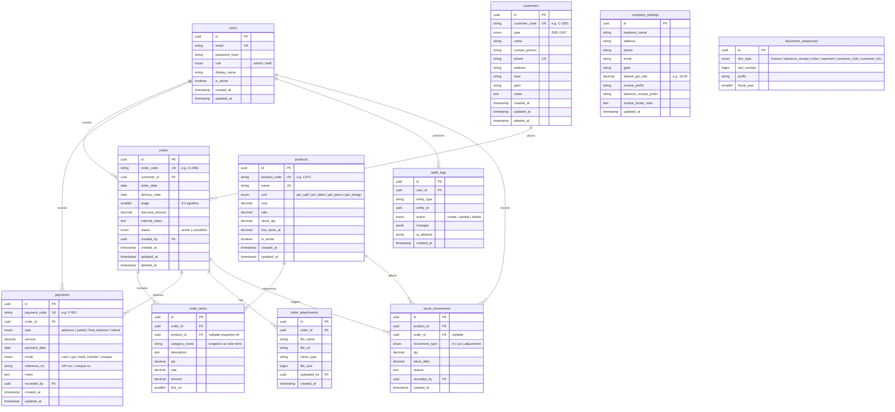

# Lukky Enterprises — Database Schema & ER Diagram

> Relational schema for persisting **Lukky Enterprises Management System v3**  
> Derived from the in-memory model in `Lukky Enterprises System v3.dc.html` plus gaps in `features.md`

---

## ER Diagram



---

## Table Summary

| # | Table | Purpose | Required for v3? |
|---|--------|---------|------------------|
| 1 | `users` | Login, Owner/Staff roles, audit attribution | Yes (production) |
| 2 | `customers` | B2B shops & B2C individuals | **Yes** |
| 3 | `products` | Product categories, pricing, stock | **Yes** |
| 4 | `orders` | Jobs / work orders | **Yes** |
| 5 | `order_items` | Line items per order | **Yes** |
| 6 | `payments` | Advance, partial, final payments | **Yes** |
| 7 | `company_settings` | Invoice header, GST, business info | Recommended |
| 8 | `document_sequences` | `O-2461`, `P-501`, `INV-0001` counters | Recommended |
| 9 | `stock_movements` | Stock in/out when orders are produced | Recommended |
| 10 | `order_attachments` | Design files, photos | Optional |
| 11 | `audit_logs` | Who changed what and when | Optional |

**Minimum viable database:** tables 2–6 (six tables).  
**Production-ready:** 1–9 (nine tables).

---

## Table Definitions

### 1. `users`

Authentication and role-based access (replaces the role toggle).

| Column | Type | Constraints | Notes |
|--------|------|-------------|-------|
| `id` | UUID | PK | |
| `email` | VARCHAR(255) | UNIQUE, NOT NULL | Login identifier |
| `password_hash` | VARCHAR(255) | NOT NULL | bcrypt / argon2 |
| `role` | ENUM | NOT NULL | `admin`, `staff` |
| `display_name` | VARCHAR(100) | NOT NULL | Shown in header |
| `is_active` | BOOLEAN | DEFAULT true | |
| `created_at` | TIMESTAMPTZ | NOT NULL | |
| `updated_at` | TIMESTAMPTZ | NOT NULL | |

---

### 2. `customers`

Maps to demo customers like **Sri Murugan Textiles** (`C-1001`).

| Column | Type | Constraints | Notes |
|--------|------|-------------|-------|
| `id` | UUID | PK | Internal ID |
| `customer_code` | VARCHAR(20) | UNIQUE, NOT NULL | `C-1001`, `C-2001` |
| `type` | ENUM | NOT NULL | `B2B`, `B2C` |
| `name` | VARCHAR(200) | NOT NULL | |
| `contact_person` | VARCHAR(100) | NULL | B2B only |
| `phone` | VARCHAR(20) | NOT NULL | Searchable |
| `address` | TEXT | NULL | |
| `area` | VARCHAR(100) | NULL | Derived from address |
| `gstin` | VARCHAR(15) | NULL | B2B invoicing |
| `notes` | TEXT | NULL | |
| `created_at` | TIMESTAMPTZ | NOT NULL | |
| `updated_at` | TIMESTAMPTZ | NOT NULL | |
| `deleted_at` | TIMESTAMPTZ | NULL | Soft delete |

**Indexes:** `phone`, `name`, `type`, `customer_code`

---

### 3. `products`

Product catalog (LED boards, titanium letters, sign boards, etc.).

| Column | Type | Constraints | Notes |
|--------|------|-------------|-------|
| `id` | UUID | PK | |
| `product_code` | VARCHAR(20) | UNIQUE, NOT NULL | `CAT1`, `PRD-01` |
| `name` | VARCHAR(150) | UNIQUE, NOT NULL | |
| `unit` | ENUM | NOT NULL | `per_sqft`, `per_letter`, `per_piece`, `per_design` |
| `cost` | DECIMAL(12,2) | DEFAULT 0 | Purchase price |
| `rate` | DECIMAL(12,2) | NOT NULL | Sale price |
| `stock_qty` | DECIMAL(12,2) | DEFAULT 0 | On-hand quantity |
| `low_stock_at` | DECIMAL(12,2) | DEFAULT 10 | Low-stock threshold |
| `is_active` | BOOLEAN | DEFAULT true | |
| `created_at` | TIMESTAMPTZ | NOT NULL | |
| `updated_at` | TIMESTAMPTZ | NOT NULL | |

**Indexes:** `name`, `is_active`

---

### 4. `orders`

Central job record. Example: **O-2461** — delivery 28 Jun, stage 2 (In Production).

| Column | Type | Constraints | Notes |
|--------|------|-------------|-------|
| `id` | UUID | PK | |
| `order_code` | VARCHAR(20) | UNIQUE, NOT NULL | `O-2461` |
| `customer_id` | UUID | FK → customers, NOT NULL | |
| `order_date` | DATE | NOT NULL | |
| `delivery_date` | DATE | NOT NULL | Used for overdue calc |
| `stage` | SMALLINT | NOT NULL, CHECK 0–4 | See pipeline below |
| `discount_amount` | DECIMAL(12,2) | DEFAULT 0 | Future: order discount |
| `internal_notes` | TEXT | NULL | Workshop notes |
| `status` | ENUM | DEFAULT active | `active`, `cancelled` |
| `created_by` | UUID | FK → users, NULL | |
| `created_at` | TIMESTAMPTZ | NOT NULL | |
| `updated_at` | TIMESTAMPTZ | NOT NULL | |
| `deleted_at` | TIMESTAMPTZ | NULL | Soft delete |

**Stage values (matches app):**

| Value | Label |
|-------|--------|
| 0 | Quoted |
| 1 | Advance Received |
| 2 | In Production |
| 3 | Ready for Delivery |
| 4 | Delivered |

**Indexes:** `customer_id`, `delivery_date`, `stage`, `order_date`, `status`

**Computed (not stored):** `total` = SUM(order_items.amount), `paid` = SUM(payments), `balance` = total − paid, `days_to_delivery` = delivery_date − CURRENT_DATE

---

### 5. `order_items`

One row per line on an order. Stores a **snapshot** of product name/rate so history stays correct if catalog changes.

| Column | Type | Constraints | Notes |
|--------|------|-------------|-------|
| `id` | UUID | PK | |
| `order_id` | UUID | FK → orders, ON DELETE CASCADE | |
| `product_id` | UUID | FK → products, NULL | Optional link |
| `category_name` | VARCHAR(150) | NOT NULL | Snapshot: "Titanium Letters" |
| `description` | TEXT | NULL | Size, material, design |
| `qty` | DECIMAL(12,2) | NOT NULL, CHECK > 0 | |
| `rate` | DECIMAL(12,2) | NOT NULL, CHECK >= 0 | |
| `amount` | DECIMAL(12,2) | NOT NULL | qty × rate |
| `line_no` | SMALLINT | NOT NULL | Display order |

**Indexes:** `order_id`, `product_id`

---

### 6. `payments`

Payment ledger per order.

| Column | Type | Constraints | Notes |
|--------|------|-------------|-------|
| `id` | UUID | PK | |
| `payment_code` | VARCHAR(20) | UNIQUE, NOT NULL | `P-501` |
| `order_id` | UUID | FK → orders, NOT NULL | |
| `type` | ENUM | NOT NULL | `advance`, `partial`, `final_balance`, `refund` |
| `amount` | DECIMAL(12,2) | NOT NULL, CHECK > 0 | |
| `payment_date` | DATE | NOT NULL | |
| `mode` | ENUM | NOT NULL | `cash`, `upi`, `bank_transfer`, `cheque` |
| `reference_no` | VARCHAR(100) | NULL | UPI / cheque reference |
| `notes` | TEXT | NULL | |
| `recorded_by` | UUID | FK → users, NULL | |
| `created_at` | TIMESTAMPTZ | NOT NULL | |
| `updated_at` | TIMESTAMPTZ | NOT NULL | |

**Indexes:** `order_id`, `payment_date`

---

### 7. `company_settings`

Single-row (or key-value) config for invoices and GST.

| Column | Type | Constraints | Notes |
|--------|------|-------------|-------|
| `id` | UUID | PK | |
| `business_name` | VARCHAR(200) | NOT NULL | Lukky Enterprises |
| `address` | TEXT | NOT NULL | |
| `phone` | VARCHAR(20) | NOT NULL | |
| `email` | VARCHAR(255) | NULL | |
| `gstin` | VARCHAR(15) | NULL | Company GSTIN |
| `default_gst_rate` | DECIMAL(5,2) | DEFAULT 18.00 | CGST+SGST split in app |
| `invoice_prefix` | VARCHAR(10) | DEFAULT 'INV' | |
| `advance_receipt_prefix` | VARCHAR(10) | DEFAULT 'AR' | |
| `invoice_footer_note` | TEXT | NULL | Legal footer text |
| `updated_at` | TIMESTAMPTZ | NOT NULL | |

---

### 8. `document_sequences`

Atomic counters for human-readable IDs.

| Column | Type | Constraints | Notes |
|--------|------|-------------|-------|
| `id` | UUID | PK | |
| `doc_type` | ENUM | UNIQUE per year | See enum below |
| `prefix` | VARCHAR(10) | NULL | |
| `last_number` | BIGINT | NOT NULL | Increment on create |
| `fiscal_year` | SMALLINT | NOT NULL | |

**doc_type values:** `order`, `payment`, `customer_b2b`, `customer_b2c`, `invoice`, `advance_receipt`

---

### 9. `stock_movements`

Tracks inventory changes (missing in v3 UI but required for real stock).

| Column | Type | Constraints | Notes |
|--------|------|-------------|-------|
| `id` | UUID | PK | |
| `product_id` | UUID | FK → products, NOT NULL | |
| `order_id` | UUID | FK → orders, NULL | When deducted for a job |
| `movement_type` | ENUM | NOT NULL | `in`, `out`, `adjustment` |
| `qty` | DECIMAL(12,2) | NOT NULL | Positive number |
| `stock_after` | DECIMAL(12,2) | NOT NULL | Balance after movement |
| `reason` | TEXT | NULL | |
| `recorded_by` | UUID | FK → users, NULL | |
| `created_at` | TIMESTAMPTZ | NOT NULL | |

**Indexes:** `product_id`, `order_id`, `created_at`

---

### 10. `order_attachments` (optional)

Design files, site photos, customer approvals.

| Column | Type | Constraints | Notes |
|--------|------|-------------|-------|
| `id` | UUID | PK | |
| `order_id` | UUID | FK → orders, ON DELETE CASCADE | |
| `file_name` | VARCHAR(255) | NOT NULL | |
| `file_url` | TEXT | NOT NULL | S3 / local path |
| `mime_type` | VARCHAR(100) | NULL | |
| `file_size` | BIGINT | NULL | Bytes |
| `uploaded_by` | UUID | FK → users, NULL | |
| `created_at` | TIMESTAMPTZ | NOT NULL | |

---

### 11. `audit_logs` (optional)

Compliance and debugging.

| Column | Type | Constraints | Notes |
|--------|------|-------------|-------|
| `id` | UUID | PK | |
| `user_id` | UUID | FK → users, NULL | |
| `entity_type` | VARCHAR(50) | NOT NULL | `order`, `payment`, etc. |
| `entity_id` | UUID | NOT NULL | |
| `action` | ENUM | NOT NULL | `create`, `update`, `delete` |
| `changes` | JSONB | NULL | Before/after diff |
| `ip_address` | VARCHAR(45) | NULL | |
| `created_at` | TIMESTAMPTZ | NOT NULL | |

**Indexes:** `entity_type` + `entity_id`, `user_id`, `created_at`

---

## Relationships

```
customers (1) ──< (N) orders
orders    (1) ──< (N) order_items
orders    (1) ──< (N) payments
products  (1) ──< (N) order_items   [optional FK]
products  (1) ──< (N) stock_movements
orders    (1) ──< (N) stock_movements [optional]
orders    (1) ──< (N) order_attachments
users     (1) ──< (N) orders        [created_by]
users     (1) ──< (N) payments      [recorded_by]
users     (1) ──< (N) audit_logs
```

**Delete rules:**

| Parent | Child | Rule |
|--------|-------|------|
| `customers` | `orders` | RESTRICT (or soft-delete customer) |
| `orders` | `order_items` | CASCADE |
| `orders` | `payments` | RESTRICT (use soft-delete on order) |
| `products` | `order_items` | SET NULL on product_id (keep snapshot name) |

---

## Sample Data Mapping (O-2461)

```text
customers     → C-1001  Sri Murugan Textiles  (B2B)
orders        → O-2461  customer_id=C-1001  delivery=2026-06-28  stage=2
order_items   → Titanium Letters  qty=14 rate=650
              → Sign Boards       qty=24 rate=180
payments      → P-501  advance  ₹6,000  UPI  2026-06-10
```

**Balances (computed):**

- Total: ₹13,420  
- Paid: ₹6,000  
- Balance: ₹7,420  
- Overdue: 2 days (as of 30 Jun 2026)

---

## Suggested Views (SQL)

These mirror dashboard logic without duplicating data.

```sql
-- v_order_summary
SELECT
  o.id,
  o.order_code,
  c.name AS customer_name,
  o.delivery_date,
  o.stage,
  COALESCE(SUM(oi.amount), 0) AS total,
  COALESCE(SUM(p.amount), 0) AS paid,
  COALESCE(SUM(oi.amount), 0) - COALESCE(SUM(p.amount), 0) AS balance,
  (o.delivery_date - CURRENT_DATE) AS days_to_delivery
FROM orders o
JOIN customers c ON c.id = o.customer_id
LEFT JOIN order_items oi ON oi.order_id = o.id
LEFT JOIN payments p ON p.order_id = o.id AND p.type != 'refund'
WHERE o.status = 'active' AND o.deleted_at IS NULL
GROUP BY o.id, c.name;

-- v_upcoming_deliveries (dashboard widget)
SELECT * FROM v_order_summary
WHERE stage < 4
ORDER BY days_to_delivery ASC
LIMIT 5;

-- v_pending_balances (dashboard widget)
SELECT * FROM v_order_summary
WHERE balance > 0
ORDER BY balance DESC
LIMIT 5;
```

---

## Tech Stack Notes

| Layer | Suggestion |
|-------|------------|
| Database | PostgreSQL (Neon) or SQLite for local dev |
| ORM | Prisma, Drizzle, or raw SQL |
| IDs | UUID internally; `order_code` / `customer_code` for display |
| Money | `DECIMAL(12,2)` — never FLOAT |
| Dates | `DATE` for business dates; `TIMESTAMPTZ` for audit |

---

## Migration from v3 Prototype

| In-memory field | Database table.column |
|-----------------|----------------------|
| `customers[]` | `customers` |
| `categories[]` | `products` |
| `orders[]` | `orders` + `order_items` |
| `payments[]` | `payments` |
| `role` toggle | `users.role` |
| `seqOrder`, `seqPay`, … | `document_sequences` |
| Invoice header HTML | `company_settings` |
